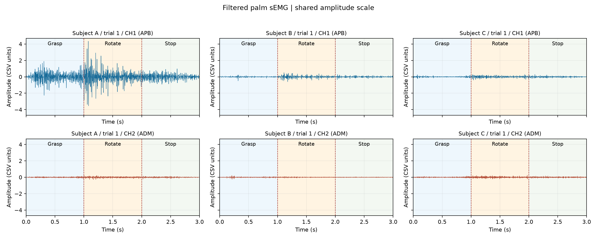
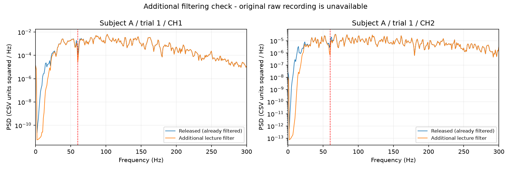
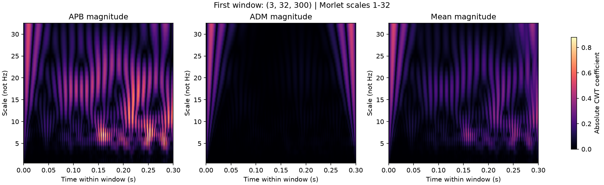
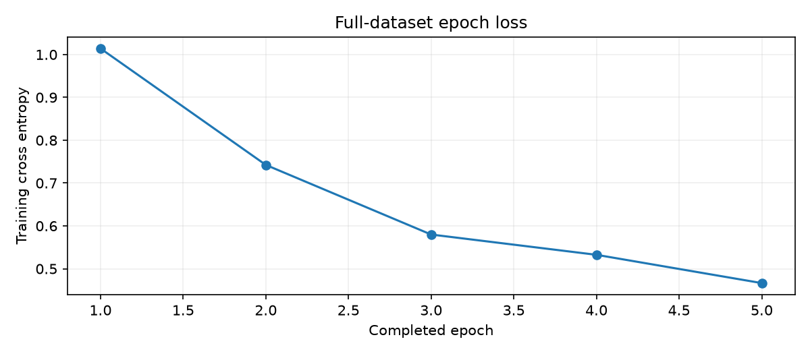
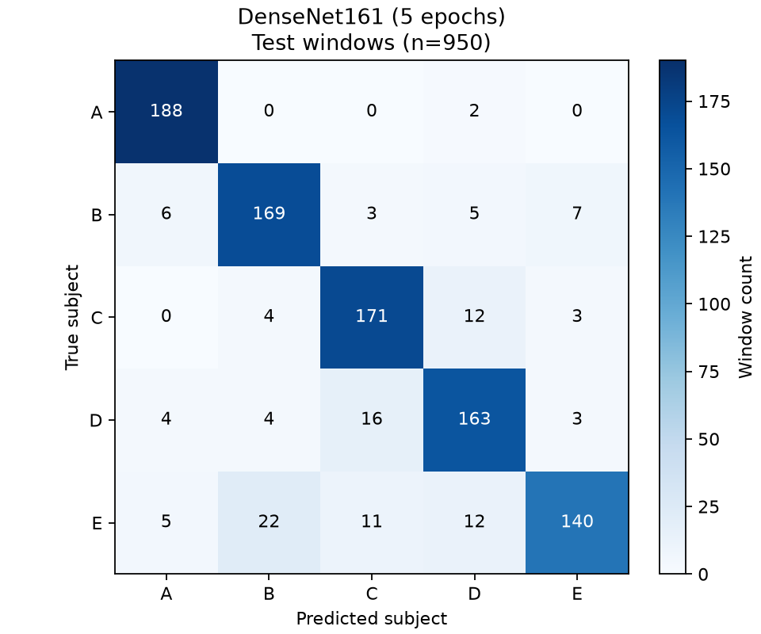
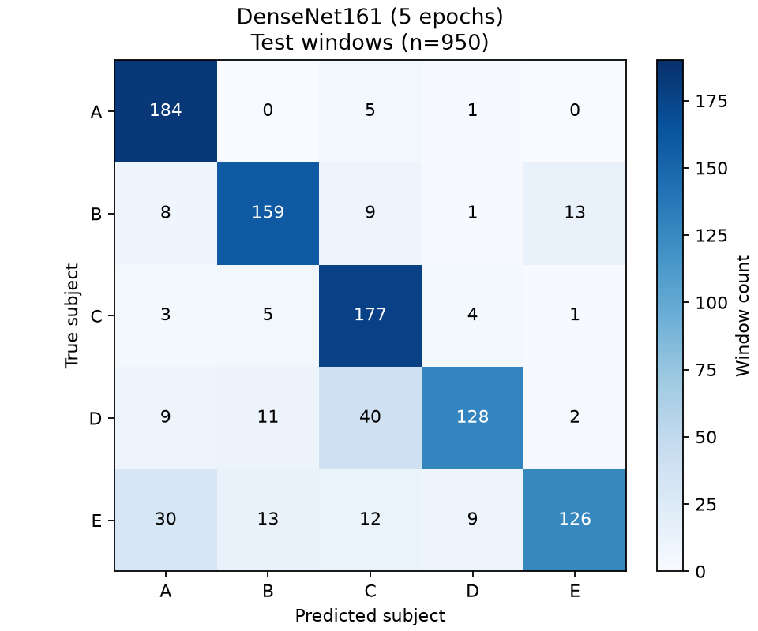
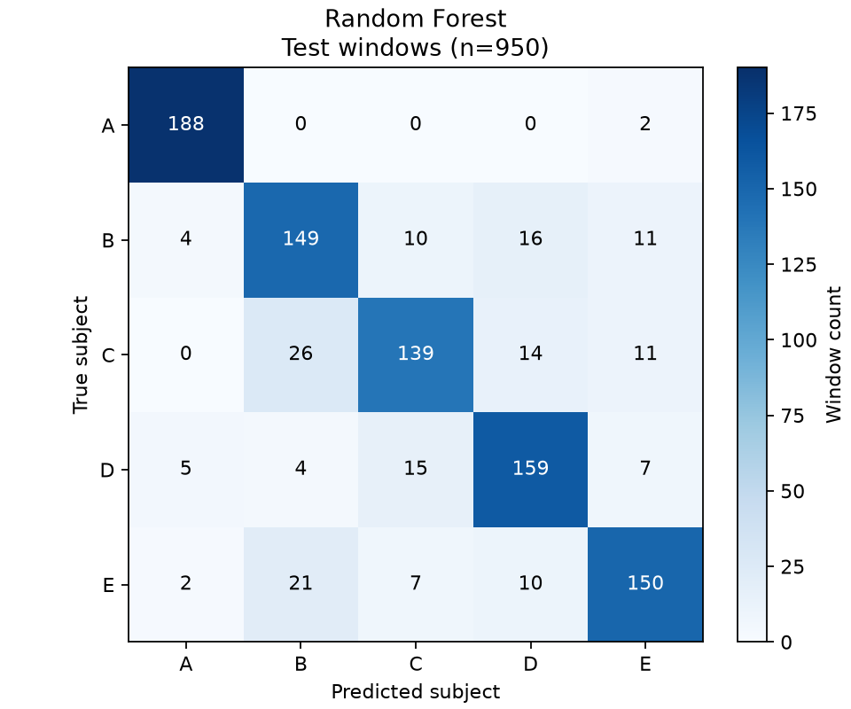

# 손바닥 sEMG 사용자 식별 — 1·2주차 통합 및 모델 성능 비교

문손잡이를 잡고 돌릴 때의 **손바닥 2채널 근전도**로 등록자 A~E 중 한 명을 구분한다. 입력이 등록자 중 하나라는 가정의 **closed-set 5-class identification**이며, 미등록자 거절이나 1:1 본인 인증 성능은 평가하지 않는다.

기존 2주차 체크포인트를 사용한 **주 비교표**에서는 같은 테스트 윈도우 950개에서 **SVM (RBF)**이 Accuracy **84.95%**, macro F1 **84.87%**로 가장 높았다. 배포 전 새 폴더 재실행 결과와 순위 변동은 2절에 별도로 공개한다. 아래 표와 그림은 이 저장소 코드로 실제 계산한 결과다.

**제출 주소:** https://github.com/sungbin25/Deep_Learning_project

## 1. 코드 설명

### 1주차: 문제 정의와 데이터 이해

- 공개 CSV의 헤더, `(3000, 2)` 배열, 유한 수치, 피험자별 50개 파일을 확인했다.
- A·B·C의 첫 시행을 공통 진폭 축과 개별 축으로 그려 비교했다. 파지(0~1초), 회전(1~2초), 정지(2~3초) 경계는 실험 절차에 따른 표시이며 이벤트 마커 검출 결과는 아니다.
- 구간별 RMS를 계산해 관찰 메모 3개를 작성하고 선행연구 비교표를 정리했다.
- A의 첫 시행 회전 구간 RMS는 채널 1 약 0.6932, 채널 2 약 0.0590이었다. B의 채널 2는 파지 RMS(0.0345)가 회전 RMS(0.0244)보다 커, 회전이 항상 최대라는 가정이 성립하지 않았다. 이는 선택한 시행의 관찰로, 개인 전체의 특성이나 식별 성능을 입증하지 않는다.



[1주차 노트북](semg_week1/week1_semg.ipynb) · [데이터 요약](semg_week1/output/data_summary.csv) · [관찰 메모](semg_week1/output/observations.md)

### 사용 데이터와 분할

데이터 출처는 [palm-sEMG-doorknob-filtered](https://github.com/sea3551/palm-sEMG-doorknob-filtered)이며, 저자 README에 명시된 샘플링 주파수는 1,000 Hz다. 각 파일은 3초·3,000샘플·2채널(APB/ADM)이다. 신호의 보정된 물리 단위는 확인하지 못해 그림에는 CSV units로 표시했다.

| 구분 | 시행 파일 수 | 윈도우 수 | 피험자별 시행 | 피험자별 윈도우 |
|---|---:|---:|---:|---:|
| 학습 | 200 | 3,800 | 40 | 760 |
| 테스트 | 50 | 950 | 10 | 190 |

총 CSV 250개 중 고유 내용은 **249개**다. `E/e (38).csv`와 `E/e (50).csv`가 동일하므로 SHA-256 그룹 단위로 묶어 같은 집합에 넣었다. 피험자별 40:10 비율과 seed 42를 고정했다. 시행을 먼저 분할하고 그 안에서 윈도우를 생성하며, **학습·테스트 사이 시행 및 동일 내용의 교집합은 0**이다. 중복 파일은 학습 집합에 유지되므로 학습 파일 200개가 모두 독립 획득이라는 뜻은 아니다.

1주차와 2주차 폴더에는 독립 실행을 위해 동일한 CSV 복사본이 각각 들어 있다. 두 복사본을 합쳐 500개 시행으로 학습하지 않는다. [분할 목록](semg_week2_RTX/output/week2/trial_split.csv) · [중복 목록](semg_week2_RTX/output/week2/duplicate_trials.csv)

### 2주차: 전처리와 DenseNet161

1. 공개 신호는 이미 필터링되어 있다. 강의 실습으로 60 Hz 노치(Q=30)와 20~499 Hz 4차 Butterworth 대역통과를 **추가 적용**한다. 시간축 양방향 필터를 사용하며 대역통과는 SOS 구현이다.
2. 300ms(300샘플) 윈도우, 150ms 홉(50% 중첩)으로 시행당 19개를 만든다.
3. 각 윈도우의 시간·채널 두 축을 함께 min-max 정규화한다. 채널별 독립 정규화와 다르다.
4. Morlet CWT 스케일 1~32의 절댓값 맵을 채널별로 계산하고, 세 번째 채널에 두 맵의 평균을 넣어 `(3, 32, 300)` 입력을 만든다.
5. DenseNet161 전체를 사전학습 없이 5에폭 학습한다. 배치 16, Adam(lr=0.001), CrossEntropyLoss, float32, seed 42를 사용한다.

300ms는 짧은 근활성 변화를 표현하는 강의 설정이다. 150ms 홉으로 연속성을 일부 유지하되 겹친 조각을 독립 시행으로 취급하지 않는다. 32개 스케일은 입력 높이와 계산량을 정하는 강의 설정이다. scale 1의 주파수 환산값은 812.5 Hz로 나이퀴스트를 넘으므로 작은 스케일의 앨리어싱 가능성을 포함한 한계가 있다.




### 비교 모델과 평가 방법

| 모델 | 입력 및 고정 설정 |
|---|---|
| DenseNet161 | CWT 전체 맵, 출력 5클래스, torchvision 기본 stem, dropout 0, memory_efficient=True, 5에폭 |
| SVM (RBF) | CWT 요약 192특징 → StandardScaler → SVC(C=1.0, gamma=scale, kernel=rbf) |
| Random Forest | 같은 CWT 요약 192특징, 트리 300개, max_features=sqrt, max_depth=None, min_samples_leaf=1, random_state=42 |

요약 특징은 같은 CWT 맵에 `log1p`를 적용한 뒤 **각 채널·스케일의 시간축 평균과 표준편차(ddof=0)**를 연결한 3×32×2=192차원이다. SVM의 StandardScaler는 학습 데이터 3,800개로만 적합한다. 모델별 데이터 분할은 같지만 DenseNet은 시간 구조를 보존하고 ML 모델은 이를 요약하므로, 이는 **세 가지 전체 분류 방법의 비교**이며 모델 구조만 통제한 실험은 아니다.

모든 설정은 비교 실행 전에 고정했다. 테스트셋으로 하이퍼파라미터나 최적 에폭을 탐색하지 않았고, 별도 검증셋·교차검증·여러 seed 반복은 수행하지 않았다. 결과 순위는 고정된 실험의 사후 기술이며 통계적 유의성을 주장하지 않는다.

### 실행 방법

Python **3.12**, Git, 약 15GB 이상의 설치·실행 여유 공간을 권장한다. 실제 검증 환경은 Windows, RTX 4060 Laptop 8GB, PyTorch 2.10.0+cu128이다. 다른 하드웨어에서도 실행할 수 있으나, 현재 결정론적 연산을 강제하지 않아 같은 seed·같은 장치에서도 DenseNet 수치와 모델 순위가 달라질 수 있다. 아래 재실행 검증의 실제 차이를 참고한다.

```bash
git clone https://github.com/sungbin25/Deep_Learning_project.git
cd Deep_Learning_project
python -m venv .venv
```

Windows PowerShell에서 가상환경 Python을 직접 사용하면 활성화 정책 변경이 필요 없다.

```powershell
# NVIDIA GPU 환경: CUDA wheel을 먼저 설치
.\.venv\Scripts\python.exe -m pip install torch==2.10.0 torchvision==0.25.0 --index-url https://download.pytorch.org/whl/cu128
.\.venv\Scripts\python.exe -m pip install -r requirements.txt
.\.venv\Scripts\python.exe main.py --require-cuda
```

CPU 환경은 아래 명령으로 설치·실행할 수 있다. DenseNet CPU 학습은 오래 걸릴 수 있다.

```powershell
.\.venv\Scripts\python.exe -m pip install torch==2.10.0 torchvision==0.25.0 --index-url https://download.pytorch.org/whl/cpu
.\.venv\Scripts\python.exe -m pip install -r requirements.txt
.\.venv\Scripts\python.exe main.py
```

Linux/macOS에서는 `.venv/bin/python`을 사용한다. Python 환경을 활성화한 경우 전체 실행 명령은 다음과 같다.

```bash
python main.py
```

기본 실행은 **1주차 노트북 → 전처리/누수 검증 → DenseNet 5에폭 학습·평가 → 2주차 노트북 → SVM·RF 학습·평가 → README 생성 → 결과 검증**이다. 기존 체크포인트가 있으면 완료 에폭부터 5에폭까지 재개하며, 이미 5에폭이면 추가 학습하지 않는다. 5에폭 초과 체크포인트는 이 비교에서 사용하지 않고 오류로 알린다.

```bash
# 저장소에 포함된 DenseNet 예측을 사용해 SVM·RF만 재학습 (CPU 가능)
python main.py --mode compare
# 저장된 결과로 README 재생성 및 검증 (학습 없음)
python main.py --mode report
# 지표·혼동행렬·데이터 동일성 검증만 수행
python verify_submission.py
```

CSV 원본, 로그, 예측, 그림, 실행 결과가 있는 노트북은 저장소에 포함했다. `.venv`, 전처리/특징 캐시, 학습 가중치·optimizer, ML 모델 파일은 제외했다. **새 clone에서 전체 실행하면 캐시와 모델이 다시 생성된다.** 원본 강의 PDF는 제출 코드 실행에 필요하지 않아 포함하지 않았다.

### 코드 파일 역할

| 파일 | 역할 |
|---|---|
| `main.py` | 1·2주차와 모델 비교를 실행하는 통합 진입점 |
| `compare_models.py` | CWT 요약 특징, SVM·RF 학습, 공통 지표·혼동행렬·예측 저장 |
| `make_submission_readme.py` | 실제 결과 파일로 이 README 생성 |
| `verify_submission.py` | 원본 파일·분할·예측 순서·지표·혼동행렬·README 링크 확인 |
| `semg_week1/analyze_week1.py` | 250개 CSV 검사, 요약표·파형·구간 RMS 생성 |
| `semg_week1/run_notebook.py` | 1주차 노트북 실행 및 HTML 생성 |
| `semg_week2_RTX/week2_pipeline.py` | 시행/해시 분할, 필터, 윈도우, 정규화, CWT |
| `semg_week2_RTX/train_week2.py` | DenseNet161 생성·학습·체크포인트 재개 |
| `semg_week2_RTX/evaluate_week2.py` | DenseNet 테스트 예측·지표·혼동행렬 |
| `semg_week2_RTX/test_week2.py` | 윈도우 경계·CWT 등가성·데이터 누수 검사 |
| `semg_week2_RTX/run_week2_notebook.py` | 2주차 노트북 실행 및 HTML 생성 |
| `requirements.txt` | 고정한 Python 패키지 설치 목록 |

## 2. 모델 성능 비교

**동일 테스트 윈도우 950개, 클래스별 190개. 모든 수치는 %.** Precision·Recall·F1-score는 5개 클래스의 **macro 평균**이다. Accuracy는 전체 정답 수/950으로 계산한다. macro F1은 클래스별 F1의 평균이며, 평균 Precision·Recall의 조화평균과는 다르다.

| Model | Accuracy | Precision (macro) | Recall (macro) | F1-score (macro) |
|---|---:|---:|---:|---:|
| DenseNet161 (5 epochs) | 81.47% | 82.86% | 81.47% | 81.09% |
| SVM (RBF) | 84.95% | 85.02% | 84.95% | 84.87% |
| Random Forest | 82.63% | 82.61% | 82.63% | 82.54% |

[원본 성능표](results/comparison/model_comparison.csv) · [실행 설정·버전·예측 출처](results/comparison/run_metadata.json)

### 성능 분석

**SVM (RBF)**이 macro F1 기준 가장 높았고, **DenseNet161 (5 epochs)**이 가장 낮았다. SVM의 요약 특징과 비선형 결정 경계가 이 고정 분할에서 유효했을 가능성이 있다. DenseNet은 파라미터가 약 2,648만 개이고 5에폭만 학습했으므로, 이 결과만으로 충분히 학습한 딥러닝 모델보다 전통 ML이 항상 우수하다고 결론내릴 수 없다. 입력 표현·학습 예산 차이에 대한 추가 통제 실험은 하지 않았다.

DenseNet의 학습 loss는 **1.0142 → 0.4665**, 최종 학습 정확도는 **82.32%**, 5에폭 순수 학습 시간은 **274.49초**였다. 전체 3,800개 샘플을 매 에폭 순회한 로그다. 추가 ML 모델의 학습 시간과 특징 추출 시간은 실행 메타데이터에 구분해 저장했다.



**평가 단위 구분:** 기존 2주차 DenseNet 보고서의 시행별 확률 평균 정확도는 **98.00% (50시행 기준)**이다. 이는 위의 윈도우 정확도와 다른 지표이며 모델 비교표에 섞지 않는다. 서로 겹치는 윈도우 950개는 독립적인 사람 950명이나 독립 시행 950개를 의미하지 않는다.


### 새 폴더에서의 재실행 검증

업로드 대상 파일만 새 폴더로 복사하고 **캐시·체크포인트 없이** 전처리와 5에폭 학습부터 다시 실행했다. 설치 패키지 환경은 기존 가상환경을 재사용했으며, 새 환경에서 패키지 다운로드를 다시 수행한 검사는 아니다. 원본 데이터 해시와 재생성된 전처리 배열은 기존 결과와 완전히 같았다. 검사 중 발견한 노트북의 Python 경로 가정을 수정했고, 이후 전체 파이프라인과 결과 검증을 통과했다.

| 재실행 모델 | Accuracy | F1-score (macro) |
|---|---:|---:|
| DenseNet161 (5 epochs) | 87.47% | 87.31% |
| SVM (RBF) | 84.95% | 84.87% |
| Random Forest | 82.63% | 82.54% |

주 비교표는 기존 2주차 DenseNet 체크포인트의 결과를 유지한 것이며, 위 표는 배포 전 재실행 검사다. **재실행에서 DenseNet의 정확도는 87.47%로 높아져 SVM보다 높은 순위가 됐다.** 같은 seed와 전처리만으로 학습 결과의 완전한 일치를 보장하지 못했다. 현재 코드는 CUDA의 결정론적 연산을 강제하지 않으며, 그 수치 차이가 학습 경로에 영향을 줄 수 있다. 이번 검사만으로 차이의 원인을 완전히 분리해 입증한 것은 아니다.

따라서 **SVM이 항상 최고라거나 DenseNet이 항상 최저라는 결론은 내릴 수 없다.** 두 실행을 모두 공개하며 높은 점수만 골라 기존 결과를 교체하지 않았다. 이 추가 실행은 여러 seed를 이용한 성능 평균·분산 추정 실험이 아니다. 후속 비교에서는 결정론 설정과 시행 그룹 기반 검증, 반복 실행을 사전에 정해야 한다.

[재실행 검사 기록](results/reproduction_check/check.json) · [재실행 성능표](results/reproduction_check/model_comparison.csv) · [재학습 로그](results/reproduction_check/training_log.csv) · [재실행 예측·행렬](results/reproduction_check/)




## 3. Confusion Matrix 분석

아래 행렬의 **행은 실제 클래스, 열은 예측 클래스**다. 모든 모델에 A~E 순서, 같은 0~190 색상 범위, 클래스별 190개 테스트 윈도우를 사용했다. '가장 잘 분류'는 클래스별 Recall, '가장 많이 오분류'는 실제 클래스 행에서 정답을 제외한 개수 기준이다.

### DenseNet161 (5 epochs)



- 가장 잘 분류된 클래스: **A (184/190, Recall 96.84%)**
- 가장 많이 오분류된 클래스: **E (126/190, Recall 66.32%)**
- 주요 오분류 유형: **D → C 40개, E → A 30개, E → B 13개**
- 오분류 원인에 대한 해석: D를 C로, E를 A로 예측하는 오류가 집중됐다. 5에폭만 학습한 모델이 해당 클래스의 시간·주파수 패턴을 충분히 구별하지 못했을 가능성이 있다. 원인을 확정하려면 학습 데이터 내부의 검증 분할과 오류 윈도우 분석이 필요하다.
- [혼동행렬 원본 CSV](results/comparison/densenet161_confusion_matrix.csv) · [클래스별 지표](results/comparison/densenet161_classification_report.csv) · [950개 예측](results/comparison/densenet161_predictions.csv)

### SVM (RBF)


- 가장 잘 분류된 클래스: **A (186/190, Recall 97.89%)**
- 가장 많이 오분류된 클래스: **C (143/190, Recall 75.26%)**
- 주요 오분류 유형: **C → B 24개, E → B 19개, C → E 13개**
- 오분류 원인에 대한 해석: C → B와 E → B 혼동이 나타났다. 시간축 평균·표준편차로 요약하면서 일부 동작 순서 정보가 사라져 해당 클래스의 특징이 겹쳤을 가능성이 있다. 혼동행렬만으로 생리학적 원인을 단정하지 않는다.
- [혼동행렬 원본 CSV](results/comparison/svm_confusion_matrix.csv) · [클래스별 지표](results/comparison/svm_classification_report.csv) · [950개 예측](results/comparison/svm_predictions.csv)

### Random Forest



- 가장 잘 분류된 클래스: **A (188/190, Recall 98.95%)**
- 가장 많이 오분류된 클래스: **C (139/190, Recall 73.16%)**
- 주요 오분류 유형: **C → B 26개, E → B 21개, B → D 16개**
- 오분류 원인에 대한 해석: SVM과 마찬가지로 C → B 및 E → B 오류가 많다. 공통으로 사용하는 요약 특징의 분리 능력과 학습 데이터 범위가 한 원인일 수 있다. 트리 구조 자체가 원인이라고 입증한 실험은 아니다.
- [혼동행렬 원본 CSV](results/comparison/random_forest_confusion_matrix.csv) · [클래스별 지표](results/comparison/random_forest_classification_report.csv) · [950개 예측](results/comparison/random_forest_predictions.csv)


## 4. 최종 결과

- 주 비교표에서 가장 성능이 좋은 모델: **SVM (RBF)** — Accuracy 84.95%, macro F1 84.87%
- 주 비교표에서 가장 성능이 낮은 모델: **DenseNet161 (5 epochs)** — Accuracy 81.47%, macro F1 81.09%
- 재실행 민감도: 별도 재실행에서는 DenseNet이 더 높은 성능을 보여 순위가 바뀌었다. 한 번의 학습 결과로 모델의 절대적인 우열을 확정하지 않는다.
- 주요 오분류 클래스: DenseNet은 D·E, SVM과 Random Forest는 C에서 상대적으로 많은 오류가 발생했다.
- 실험에서 확인한 점: 데이터의 시행·중복 여부를 확인하고 동일한 분할·평가 단위를 유지해야 모델을 비교할 수 있다. 복잡한 모델이 짧은 학습에서도 항상 우수한 것은 아니며, 전체 정확도와 함께 클래스별 오류를 보는 것이 필요하다.
- 한계와 후속 과제: 등록자 5명, 한 번의 80:20 시행 분할, DenseNet 5에폭의 실습 결과다. 새로운 사람·다른 날·다른 장비로 일반화되는지 확인하지 않았고 미등록자 거절도 평가하지 않았다. 다음 단계에서는 학습셋 내부에서 시행 그룹 기반 검증·교차검증과 사전에 정한 45에폭 학습을 수행할 수 있다.

이 프로젝트는 강의 실습의 재현 및 확장이다. 원 논문의 수정 stem·dropout 등 모든 구현 세부를 정확히 재현하거나 논문 성능을 재달성했다고 주장하지 않는다. 1주차 선행연구 표의 정확도는 문헌 보고값이며 위 실제 실험 결과와 구분한다.

## 5. 결과물과 출처

- [1주차 실행 노트북](semg_week1/week1_semg.ipynb), [HTML 보고서](semg_week1/output/week1_report.html)
- [2주차 실행 노트북](semg_week2_RTX/week2_semg.ipynb), [HTML 보고서](semg_week2_RTX/output/week2/week2_report.html)
- [DenseNet 5에폭 로그](semg_week2_RTX/output/week2/training_log.csv), [GPU 환경](semg_week2_RTX/output/week2/gpu_environment.json)
- [3개 모델 성능·혼동행렬·예측](results/comparison/), [검증 결과](results/comparison/verification.json)
- [대상 논문](https://doi.org/10.1038/s41598-026-46294-3), [공개 데이터 저장소](https://github.com/sea3551/palm-sEMG-doorknob-filtered)
- [SVC 공식 문서](https://scikit-learn.org/stable/modules/generated/sklearn.svm.SVC.html), [RandomForest 공식 문서](https://scikit-learn.org/stable/modules/generated/sklearn.ensemble.RandomForestClassifier.html), [macro 지표 정의](https://scikit-learn.org/stable/modules/generated/sklearn.metrics.precision_recall_fscore_support.html)

공개 데이터: © 2025 Yeonjung Shin, **CC BY 4.0**. 원본 [데이터 README](semg_week2_RTX/data/README.md)와 [LICENSE](semg_week2_RTX/data/LICENSE)를 보존했고 CSV 원본을 변경하지 않았다. 필터·윈도우·CWT 및 비교 결과는 이 프로젝트에서 생성한 파생 산출물이다.

데이터/전처리 식별자: `3002b32a07766ac629d5ac703bea78e9bd5f5bdf7fefbabf94f8a833e7d6c519`. 코드가 결과 파일에서 표·분석 수치를 생성하므로 변경된 실험은 `python main.py --mode report`로 문서와 일치시킬 수 있다.
